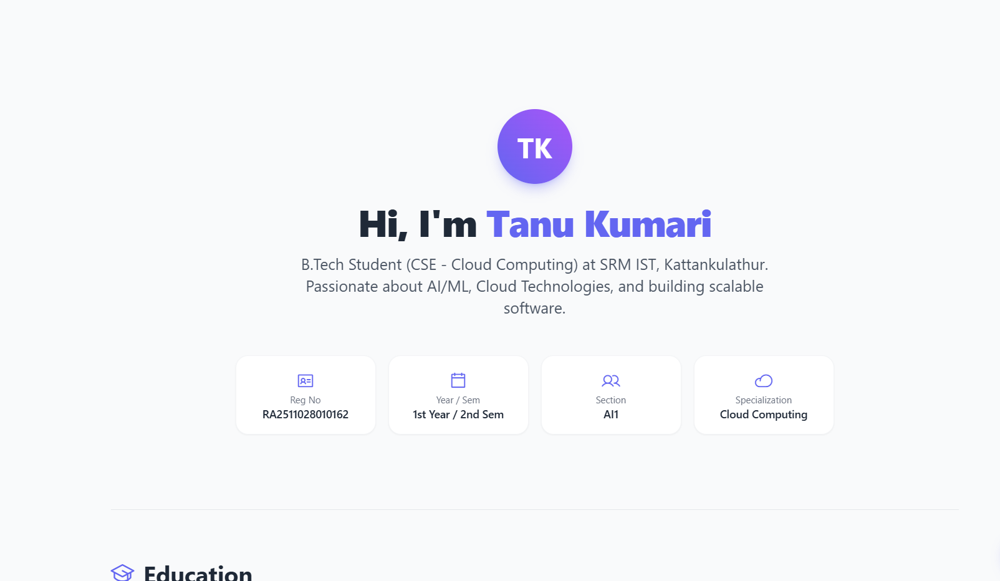

# My Personal Portfolio Website

Hi! I'm Tanu Kumari, a 1st-year B.Tech student studying Computer Science and Engineering (Specialization in Cloud Computing) at SRM IST. 

I built this simple static website to complete my task of deploying a webpage to the internet. This portfolio is a way for me to practice coding and showcase my education, the technical skills I am currently learning, and my participation in college committees.

## Technologies Used
* HTML
* CSS
* JavaScript

## Website Screenshots

Here is what the website looks like:

### 1. Home Section

### 2. Education & Technical Skills
.png)

### 3. Committees & Experience
.png)

## Live Demo
**Live Website URL:** [Paste your Netlify/Vercel/GitHub Pages live link here]
